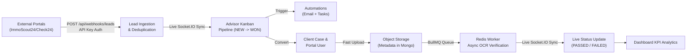

# LeadFlow — Multi-Tenant SaaS for German Mortgage Brokerages

[](file:///server/src/__tests__)
[](https://www.typescriptlang.org/)
[](LICENSE)

LeadFlow is an end-to-end, multi-tenant SaaS CRM and document verification platform tailored for the German mortgage brokerage market (*Baufinanzierung*). It ingests leads from external real-estate and comparison portals (ImmoScout24, Check24, Interhyp), manages pipeline progression with automated task and email notifications, converts qualified leads into portal clients, and performs asynchronous background OCR verification on uploaded mortgage proof documents using BullMQ and Redis.

---

## Table of Contents
1. [Product Overview & Core Workflow](#1-product-overview--core-workflow)
2. [Architecture](#2-architecture)
3. [Tech Stack](#3-tech-stack)
4. [Multi-Tenancy & Security Model](#4-multi-tenancy--security-model)
5. [Database Design](#5-database-design)
6. [API & Webhook Documentation](#6-api--webhook-documentation)
7. [Queue & Worker Architecture](#7-queue--worker-architecture)
8. [Setup & Quickstart](#8-setup--quickstart)
9. [Environment Variables](#9-environment-variables)
10. [Demo Credentials](#10-demo-credentials)
11. [Testing & Verification](#11-testing--verification)
12. [Deployment (Docker & Cloud)](#12-deployment-docker--cloud)
13. [Limitations & Trade-Offs](#13-limitations--trade-offs)

---

## 1. Product Overview & Core Workflow

Mortgage brokerages in Germany handle high-value financing leads from multiple external sources. LeadFlow provides strict multi-tenant isolation, automated workflows, and asynchronous document processing:



### Core Flow Details:
1. **Webhook Ingestion**: External tools send lead data via authenticated POST requests. Email addresses are lowercased and trimmed; phone numbers in German domestic (`0170...`), E.164 (`+49170...`), or spaced formats are normalized to unified E.164 standard.
2. **Idempotency & Duplicate Person Detection**:
   - `brokerageId + externalId` compound unique index guarantees idempotent processing: duplicate webhook calls return `200 OK` with `{ deduplicated: true }` without creating duplicate records.
   - Normalized email and phone are evaluated against existing brokerage leads to detect duplicate people arriving with new external IDs.
3. **Advisor Kanban Pipeline**: Supports stages `NEW`, `CONTACTED`, `QUALIFIED`, `APPLICATION`, `WON`, `LOST`. Advancing stages automatically:
   - Validates authorization and tenant ownership.
   - Triggers linked email templates with dynamic placeholders (`{{clientName}}`, `{{advisorName}}`, `{{brokerageName}}`).
   - Creates configured due tasks for advisors.
   - Emits real-time Socket.IO events to all open screens in the brokerage room.
4. **Lead-to-Client Conversion**: Authorized advisors convert a lead with 1 click, provisioning an authenticated `CLIENT` account while preventing duplicate conversions.
5. **Client Portal & Asynchronous Document Verification**: Clients log into their dedicated portal, upload mortgage verification documents (salary slips, SCHUFA certificates). Uploads return immediately with status `UPLOADED`. A background BullMQ worker processes OCR verification asynchronously, simulates realistic processing, handles failures and retries, and broadcasts live results via Socket.IO.

---

## 2. Architecture

```
[ Frontend: React + TypeScript + Vite + Tailwind + TanStack Query + Socket.IO Client ]
                                   │
                    HTTP REST API  ▼  WebSocket Real-Time
[ Backend: Node.js + Express + TypeScript + Zod + Helmet + Socket.IO Server ]
             │                                              ▲
   Mongoose  ▼                                              │ Worker Events
[ MongoDB 7.0 (Multi-Tenant Storage) ]                      │
             │                                              │
      BullMQ ▼ Jobs                                         │
[ Redis Queue (ioredis / Embedded RedisMemoryServer) ]       │
             │                                              │
             ▼                                              │
[ Background Worker (Simulated OCR, Retries, Failure Handling) ────┘ ]
             │
             ▼
[ Document Object Storage (Local disk with safe isolated streaming) ]
```

---

## 3. Tech Stack

- **Frontend**:
  - React 18 + TypeScript + Vite
  - React Router DOM (Role-aware routing & layouts)
  - TanStack Query v5 (Optimistic caching & reactive invalidation)
  - Tailwind CSS (German financial enterprise styling)
  - Lucide React (Icons)
  - Socket.IO Client (Tenant-scoped live streaming)
- **Backend**:
  - Node.js 20+ & Express with TypeScript
  - MongoDB 7.0 & Mongoose ODM
  - Zod (Schema validation for all incoming requests)
  - JSON Web Tokens (`jsonwebtoken`) & `bcryptjs`
  - Helmet (HTTP security headers) & CORS
  - `express-rate-limit` (API defense)
  - Multer (Safe multipart file uploads)
- **Async Queue & Realtime**:
  - Redis 7 & BullMQ (Job queueing, backoff retries, error handling)
  - Embedded `redis-memory-server` fallback for zero-dependency local dev & testing
  - Socket.IO (Tenant-scoped rooms: `tenant:${brokerageId}`, `client:${clientId}`)
- **Email**:
  - Nodemailer with configurable SMTP / Console / JSON transporter stream

---

## 4. Multi-Tenancy & Security Model

### Tenant Isolation:
- Every brokerage-owned entity (`User`, `Lead`, `Client`, `Document`, `Task`, `EmailTemplate`, `PipelineStage`) contains an indexed `brokerageId` field.
- **Server-Side Enforcement**: All queries strictly include `{ brokerageId: req.brokerageId }`. Frontend filtering is never relied upon.
- **Anti-IDOR Protection**: The `enforceTenant` middleware verifies that the authenticated user belongs to the target brokerage. Any attempt by a tenant user to pass or tamper with another brokerage's ID via URL route parameters, body parameters, or headers (`x-brokerage-id`) is immediately blocked with `403 Forbidden`.
- **Role-Based Access Control (RBAC)**:
  - `PLATFORM_ADMIN`: Cross-tenant supervision.
  - `BROKERAGE_ADMIN`: Manage brokerage settings, email templates, pipeline stages, users, and leads.
  - `ADVISOR`: Manage leads, client cases, tasks, and documents in their assigned brokerage.
  - `CLIENT`: Self-service portal restricted strictly to their own client record and uploaded documents (`/api/clients/me` and `/api/documents/client`).
- **Real-Time Room Isolation**: Sockets automatically join room `tenant:${user.brokerageId}` upon JWT verification. Events emitted to Brokerage A are physically never delivered to sockets in Brokerage B.

---

## 5. Database Design

### Schemas and Indexes:

1. **Brokerage (`Brokerages`)**
   - Fields: `name`, `slug` (unique), `apiKey` (unique index), `status` ('ACTIVE' | 'INACTIVE' | 'SUSPENDED').
2. **User (`Users`)**
   - Fields: `brokerageId` (ref Brokerage, nullable for PLATFORM_ADMIN), `name`, `email`, `passwordHash` (hidden by default), `role`, `isActive`.
   - Index: Compound unique `{ email: 1, brokerageId: 1 }`.
3. **Lead (`Leads`)**
   - Fields: `brokerageId`, `externalId`, `name`, `email`, `phone`, `source`, `stage`, `assignedAdvisorId`, `clientId`, `metadata`.
   - Indexes:
     - Compound unique partial index: `{ brokerageId: 1, externalId: 1 }` (guarantees webhook idempotency).
     - Fast lookup indexes: `{ brokerageId: 1, email: 1 }`, `{ brokerageId: 1, phone: 1 }`, `{ brokerageId: 1, stage: 1 }`, `{ brokerageId: 1, createdAt: -1 }`.
4. **Client (`Clients`)**
   - Fields: `brokerageId`, `userId` (unique), `leadId` (ref Lead), `caseStatus`, `notes`.
   - Index: Compound unique `{ brokerageId: 1, leadId: 1 }` (prevents duplicate lead conversion).
5. **Document (`Documents`)**
   - Fields: `brokerageId`, `clientId`, `uploadedBy`, `originalName`, `storageKey` (unique), `mimeType`, `size`, `status` ('UPLOADED' | 'PROCESSING' | 'PASSED' | 'FAILED'), `failureReason`, `verificationDetails`.
   - Indexes: `{ brokerageId: 1, clientId: 1 }`, `{ brokerageId: 1, status: 1 }`.
6. **Task (`Tasks`)**
   - Fields: `brokerageId`, `leadId`, `assignedTo`, `title`, `description`, `dueAt`, `status` ('PENDING' | 'COMPLETED'), `completedAt`.
   - Indexes: `{ brokerageId: 1, status: 1, dueAt: 1 }`, `{ brokerageId: 1, leadId: 1 }`.
7. **EmailTemplate (`EmailTemplates`)**
   - Fields: `brokerageId`, `name`, `subject`, `body`.
   - Index: Compound unique `{ brokerageId: 1, name: 1 }`.
8. **PipelineStage (`PipelineStages`)**
   - Fields: `brokerageId`, `name`, `order`, `emailTemplateId`, `taskTemplates` (`[{ title, dueDays, description }]`).
   - Indexes: `{ brokerageId: 1, order: 1 }`, `{ brokerageId: 1, name: 1 }` (unique).

---

## 6. API & Webhook Documentation

### Authentication & Users
- `POST /api/auth/login`: Authenticate and receive JWT + user profile + brokerage info.
- `POST /api/auth/register`: Provision a new brokerage, admin user, and seed default stages.
- `GET /api/auth/profile`: Get authenticated user profile.
- `GET /api/auth/advisors`: List advisors belonging to current tenant.
- `POST /api/auth/users`: Create advisor/admin user (Brokerage Admin only).

### Lead Webhook Ingestion
- `POST /api/webhooks/leads`:
  - **Headers**: `x-api-key: <Brokerage.apiKey>` (or global `WEBHOOK_API_KEY`)
  - **Body**:
    ```json
    {
      "externalId": "EXT-10492",
      "name": "Maximilian Becker",
      "email": "max.becker@outlook.de",
      "phone": "+49 170 / 1234567",
      "source": "ImmoScout24",
      "metadata": {
        "loanAmount": 450000,
        "city": "Berlin"
      }
    }
    ```
  - **Behavior**:
    - Normalizes email to lowercase trimmed string.
    - Normalizes German domestic phone (`0170...`) and spaced numbers to `+491701234567`.
    - If `brokerageId + externalId` already exists, returns `200 OK` with `{ deduplicated: true }`.
    - If email or phone matches an existing person in this brokerage, flags `{ duplicatePersonDetected: true }`.
    - Automatically creates initial tasks and triggers stage emails.
    - Emits `lead:created` on Socket.IO.

### Lead Pipeline
- `GET /api/leads`: List tenant leads with stage/advisor/search filtering.
- `GET /api/leads/:id`: Get lead details (tenant protected against IDOR).
- `POST /api/leads`: Create manual lead from advisor UI.
- `PATCH /api/leads/:id/stage`: Transition stage (advances pipeline, generates tasks, sends template email, emits `lead:stageChanged`).

### Client Case Management
- `POST /api/clients/convert/:leadId`: Convert lead to client + provision `CLIENT` user account.
- `GET /api/clients`: List tenant clients.
- `GET /api/clients/:id`: Get client case details.
- `GET /api/clients/me`: Self-service portal endpoint for logged-in `CLIENT` role.
- `PATCH /api/clients/:id/status`: Update case status (`PENDING_DOCUMENTS`, `UNDER_REVIEW`, `APPROVED`, `REJECTED`).

### Documents & Object Storage
- `POST /api/documents/upload`: Fast multipart file upload. Queues BullMQ verification job and returns immediately with `UPLOADED` status.
- `GET /api/documents`: List tenant documents.
- `GET /api/documents/client/:clientId?`: List documents for specific client.
- `GET /api/documents/:id/download`: Secure file stream download enforcing tenant isolation and client self-access boundaries.

### Tasks
- `GET /api/tasks`: List tasks with status filtering and automatic overdue calculation.
- `PATCH /api/tasks/:id/status`: Toggle `PENDING` / `COMPLETED`.

### Analytics & Settings
- `GET /api/dashboard/stats`: Fast indexed aggregation of total leads, stage funnel, pending/overdue tasks, and document OCR counts.
- `GET /api/settings/stages`: List pipeline stages and linked automations.
- `PUT /api/settings/stages/:id`: Update stage email template or task templates.
- `GET /api/settings/email-templates`: List email templates.
- `POST /api/settings/email-templates`: Create new template with `{{clientName}}`, `{{advisorName}}`, `{{brokerageName}}`.

---

## 7. Queue & Worker Architecture

```
[ POST /api/documents/upload ]
             │
             ├─ Save file to Object Storage (UUID storageKey)
             ├─ Create Document in MongoDB (status: 'UPLOADED')
             ├─ Queue BullMQ Job: 'verify-document'
             │
      Fast Return (HTTP 201 Created)
             │
             ▼
     [ BullMQ Queue: document-verification ]
             │
             ▼
     [ BullMQ Document Worker ]
             │
             ├─ 1. Mark status 'PROCESSING' -> emit Socket.IO 'document:updated'
             ├─ 2. Worker retry simulation (retries with exponential backoff on transient errors)
             ├─ 3. Simulated slow OCR verification (2000ms delay)
             ├─ 4. Evaluate document validity:
             │     ├─ If test error keyword present -> mark 'FAILED' + failureReason
             │     └─ Else -> mark 'PASSED' + confidenceScore + verifiedFields
             ├─ 5. Save final status to MongoDB
             └─ 6. Emit Socket.IO 'document:updated' to tenant and client rooms
```

---

## 8. Setup & Quickstart

### Prerequisites
- Node.js 18+ (tested on Node v22)
- MongoDB running locally on port 27017 (or MongoDB Atlas / Docker)
- Redis running on port 6379 (optional; if not running, LeadFlow **automatically spins up an embedded in-memory Redis instance** with zero configuration required!)

### Installation
From the root directory:
```bash
# 1. Install all dependencies (root, server, and client)
npm run install:all

# 2. Seed database with realistic German mortgage brokerages and demo accounts
npm run seed
```

### Running in Development
```bash
# Unified dev command (runs Server, BullMQ Worker, and Client concurrently):
npm run dev

# Or run separately:
npm run dev:server   # Starts Express + Socket.IO on port 5000
npm run dev:client   # Starts Vite React client on port 5173
```
Open your browser at `http://localhost:5173`.

---

## 9. Environment Variables

Create `server/.env` based on `server/.env.example`:
```env
PORT=5000
NODE_ENV=development
MONGODB_URI=mongodb://127.0.0.1:27017/leadflow
REDIS_URL=redis://127.0.0.1:6379
JWT_SECRET=leadflow-super-secret-jwt-key-german-mortgage-saas-2025
JWT_EXPIRES_IN=7d
WEBHOOK_API_KEY=lf_webhook_secret_key_89741b2c349
STORAGE_DIR=./uploads
EMAIL_PROVIDER=console
SMTP_FROM=LeadFlow <noreply@leadflow.de>
CLIENT_URL=http://localhost:5173
```

---

## 10. Demo Credentials

The database seed provides two completely isolated brokerages:

### Brokerage A: HypoTech Berlin GmbH (Slug: `hypotech-berlin`)
- **Admin**: `admin@hypotech.de` | Password: `password123`
- **Advisor**: `lukas.advisor@hypotech.de` | Password: `password123`
- **Client (Hanna Schmidt)**: `hanna.schmidt@gmail.com` | Password: `password123`
- **Webhook API Key**: `lf_hypotech_berlin_key_123`

### Brokerage B: München Baufinanz AG (Slug: `muenchen-baufinanz`)
- **Admin**: `admin@muenchen-baufinanz.de` | Password: `password123`
- **Advisor**: `stefan.advisor@muenchen-baufinanz.de` | Password: `password123`
- **Webhook API Key**: `lf_muenchen_baufinanz_key_456`

*(Tip: In the login screen, click any of the 1-click demo buttons to sign in instantly.)*

---

## 11. Testing & Verification

LeadFlow includes a comprehensive automated test suite with 20 tests covering all MVP assessment criteria.

To execute tests:
```bash
npm run test
# Or inside server directory:
npm --prefix server test
```

### Automated Test Coverage:
1. `auth_and_rbac.test.ts`:
   - Valid credentials authentication & JWT token generation.
   - Invalid password rejection.
   - Unauthenticated access rejection.
   - RBAC rejection (CLIENT role attempting to access advisor pipeline -> `403 Forbidden`).
   - Cross-tenant tampering rejection (Advisor A attempting to query Brokerage B data -> `403 Forbidden`).
2. `leads_webhook_and_dedup.test.ts`:
   - Rejection of unauthenticated webhooks.
   - Ingestion with email and German phone normalization.
   - Idempotency with identical `externalId` returning `200 OK` with `deduplicated: true`.
   - Cross-brokerage multi-tenant identical externalId handling without collision.
   - Duplicate person detection via normalized email or phone.
3. `pipeline_and_automations.test.ts`:
   - Stage transition from `NEW` to `CONTACTED` triggering automated task generation and template email dispatch.
   - IDOR prevention: Advisor B cannot update Brokerage A leads.
   - Concurrent simultaneous stage updates handling.
4. `client_conversion_and_docs.test.ts`:
   - Lead conversion provisioning `CLIENT` user and client case record.
   - Duplicate lead conversion rejection (`409 Conflict`).
   - Client portal login and access to own case.
   - Fast document upload returning `UPLOADED` status.
   - Background BullMQ worker asynchronous verification transitioning to `PASSED`.
   - Simulated OCR verification failure transitioning to `FAILED` with `failureReason`.
5. `dashboard_isolation.test.ts`:
   - Brokerage A dashboard displays only Brokerage A metrics and counts.
   - Brokerage B dashboard displays only Brokerage B metrics and counts.
   - Overdue tasks KPI calculations.

---

## 12. Deployment (Docker & Cloud)

### Production Docker Compose
The repository includes a production-ready `docker-compose.yml`:
```bash
docker compose up -d --build
```
This starts:
- MongoDB on `27017`
- Redis on `6379`
- Express API & Worker on `5000`
- Nginx serving the production Vite client on `3000` (with reverse proxying to `/api` and `/socket.io`)

### Low-Cost / Free Cloud Deployment Strategy:
- **Backend & Worker**: Render, Railway, or Fly.io (Node container).
- **Database**: MongoDB Atlas (Free Tier 512MB M0 cluster).
- **Redis Queue**: Upstash Redis (Free Serverless Redis) or Railway Redis.
- **Frontend**: Vercel, Netlify, or Cloudflare Pages.
- **Object Storage**: AWS S3, Cloudflare R2 (zero egress fees), or persistent Render disk.
- **Email**: Resend (free 3,000 emails/month) or Brevo.

---

## 13. Limitations & Trade-Offs

- **OCR Simulation**: OCR verification is intentionally simulated with realistic 2-3 second delays and parsing checks rather than attaching a proprietary Tesseract/AWS Textract engine, ensuring instant reproducibility without external cloud API dependencies.
- **Storage Strategy**: Document binaries are saved to disk object storage (`./uploads` / volume) rather than MongoDB GridFS to avoid database bloat, keeping Mongo lean and performant. In high-scale multi-region setups, Cloudflare R2 / AWS S3 pre-signed URLs would replace direct uploads.
- **WebSocket Rooms**: Socket.IO uses in-memory tenant room matching. For horizontal multi-instance node clusters, `socket.io-redis-adapter` would be wired to the existing Redis instance.
